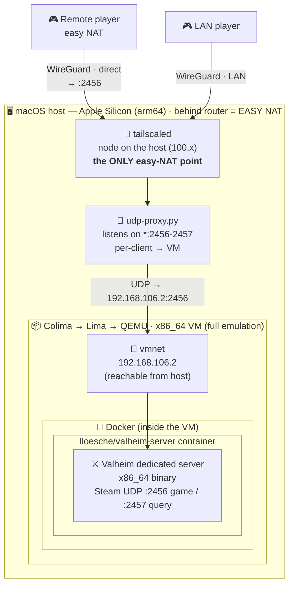

# Architecture — how it works

The Valheim server is an **x86_64** binary, so on an **Apple-silicon (arm64)** Mac it has to run
under emulation. On top of that there's the network goal: friends should connect **without a public
IP or port-forwarding**, and a remote player should play **smoothly** (direct P2P, not via a relay).
Hence a few nested layers.

TL;DR in one picture — the arrow follows a packet from the player to the game engine:


<details>
<summary>📝 diagram source (Mermaid — editable; GitHub also renders it natively)</summary>



</details>

---

## Layers of abstraction (matryoshka)

Each box lives **inside** the previous one. From the physical Mac down to the game engine process:

```
┌────────────────────────────────────────────────────────────────────────────┐
│  🖥️  macOS — Apple Silicon (arm64)                  behind the router  =  EASY NAT │
│                                                                              │
│   🔑 tailscaled .......... node on the host (addr 100.x)  ──────── easy NAT ✔ │
│   🔀 udp-proxy.py ........ listens on *:2456-2457  ──►  relays to the VM       │
│                                                                              │
│   ┌──────────────────────────────────────────────────────────────────────┐  │
│   │  📦 Colima ─► Lima ─► QEMU :  x86_64 VM   (full emulation, not Rosetta) │  │
│   │     vmnet:  192.168.106.2   (host⇄VM bridge, via --network-address)     │  │
│   │                                                                        │  │
│   │   ┌────────────────────────────────────────────────────────────────┐  │  │
│   │   │  🐳 Docker  (engine inside the VM)                               │  │  │
│   │   │   ┌──────────────────────────────────────────────────────────┐  │  │  │
│   │   │   │  📦 container  lloesche/valheim-server                    │  │  │  │
│   │   │   │       ⚔️ Valheim dedicated server  (x86_64 binary)         │  │  │  │
│   │   │   │       Steam UDP  :2456 (game)  ·  :2457 (query)           │  │  │  │
│   │   │   │       + auto-update + periodic world backups             │  │  │  │
│   │   │   └──────────────────────────────────────────────────────────┘  │  │  │
│   │   └────────────────────────────────────────────────────────────────┘  │  │
│   └──────────────────────────────────────────────────────────────────────┘  │
└────────────────────────────────────────────────────────────────────────────┘
```

| # | Layer | Technology | Role | Why this way |
|---|-------|------------|------|--------------|
| 1 | Host | **macOS / Apple Silicon** | the machine; the network node lives here | it's behind the router's **easy NAT** — the key to direct P2P |
| 2 | Node network | **tailscaled (on the host)** | tailnet node on the host, address `100.x` | only the **host** has easy NAT; a node inside the VM is symmetric |
| 3 | UDP bridge | **udp-proxy.py** | `*:2456-2457` on the host → port in the VM | Lima does **not** forward UDP; socat mangled multi-client |
| 4 | Virtualization | **Colima → Lima → QEMU** | **x86_64** VM on arm64 | the server only exists as an x86_64 binary |
| 5 | VM network | **vmnet** (`--network-address`) | gives the VM IP `192.168.106.2`, reachable from the host | without it the host can't reach the container |
| 6 | Containerization | **Docker** (in the VM) | isolation + automation (update/backup) | the `lloesche` image ships this out of the box |
| 7 | Application | **Valheim dedicated** | the actual game server | — |

> Why **QEMU** and not Docker Desktop + Rosetta: Rosetta crashes this server's mono/Unity engine.
> Full QEMU is slower but stable. Details: [TROUBLESHOOTING.md](TROUBLESHOOTING.md).

---

## The crux: why the Tailscale node lives on the HOST, not in the VM

This was the whole "remote player lags, local player doesn't" puzzle. A direct P2P connection in
Tailscale needs **easy NAT on both ends**. And the NAT type depends on **where** the node sits:

```
 ❌ TS node INSIDE the VM        VM ─QEMU NAT (slirp/vmnet)─ router ─ internet
                                 └── double NAT = SYMMETRIC  →  DERP relay  →  jitter / lag

 ✔ TS node ON the Mac HOST       Mac ─ router ─ internet
                                 └── single EASY NAT  →  direct P2P  →  smooth, low ping
```

QEMU's symmetric NAT is an **artifact of virtualization**, not a property of your link. Verified
empirically: `tailscale netcheck` from inside the VM always reported `MappingVariesByDestIP: true`
(even with vmnet), while from the host it was `false` + `PortMapping: UPnP, NAT-PMP, PCP`. So the
node has to sit on the host, and a `udp-proxy.py` bridge carries traffic to the container
(host ⇄ vmnet ⇄ VM).

**Rejected alternatives (and why):**
- **Wired Ethernet + Colima bridged** — gives true direct P2P (lowest ping), but an L2 bridge won't
  work over Wi-Fi → needs a USB-C→Ethernet adapter. Unnecessary once host-TS gives direct without a cable.
- **Tailscale Peer Relay** — works, but it's still a relay (higher ping) and needs a relay node online.
- **A paid host with a public IP** — removes the whole NAT problem, but costs money every month.

Host-TS won: **direct P2P, $0, no cable.**

---

## Connection lifecycle (a play session)


<details>
<summary>📝 diagram source (Mermaid — editable; GitHub also renders it natively)</summary>


</details>

---

## How it all comes up with one command

`./scripts/play.sh` assembles the layers in order:

1. `colima start … --network-address` → x86_64 VM + a vmnet address (layers 4-5),
2. `docker compose up -d` → container + server (layers 6-7),
3. `scripts/host-ts-bridge.sh start` → `udp-proxy.py` on the host (layer 3),
4. prints the **Join IP = the host node's address** (`tailscale ip -4`).

`./scripts/stop.sh` unwinds it in reverse (bridge → server → VM) + backs up the world.

> The simple variant (no direct P2P, old in-VM Tailscale sidecar) stays as a rollback:
> `docker-compose.sidecar.yml` (restores the Tailscale node inside the VM — simpler, but laggy for remote players).
