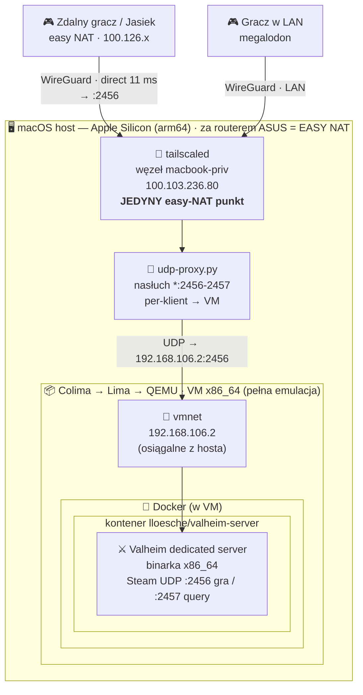
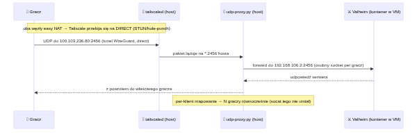
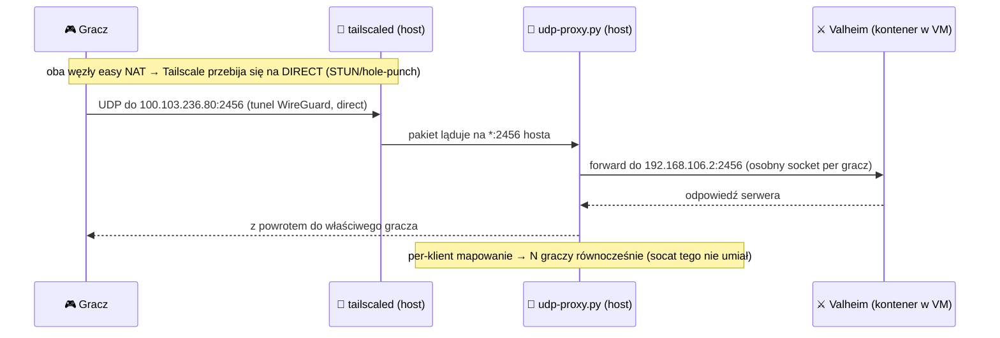

# Architektura — jak to działa

Serwer Valheim to binarka **x86_64**, więc na Macu z **Apple Silicon (arm64)** musi iść przez
emulację. Do tego dochodzi sieć: znajomi mają wejść **bez publicznego IP i port-forwardingu**, a
zdalny gracz ma grać **płynnie** (direct P2P, nie przez relay). Stąd kilka zagnieżdżonych warstw.

TL;DR jednym obrazkiem — strzałka pokazuje drogę pakietu od gracza do silnika gry:


<details>
<summary>📝 kod źródłowy diagramu (Mermaid — edytowalny; GitHub renderuje go też natywnie)</summary>



</details>

---

## Warstwy abstrakcji (matrioszka)

Każda ramka żyje **wewnątrz** poprzedniej. Od fizycznego Maca aż do procesu silnika gry:

```
┌────────────────────────────────────────────────────────────────────────────┐
│  🖥️  macOS — Apple Silicon (arm64)               za routerem ASUS  =  EASY NAT │
│                                                                              │
│   🔑 tailscaled .......... węzeł "macbook-priv" 100.103.236.80  ── easy NAT ✔ │
│   🔀 udp-proxy.py ........ nasłuch *:2456-2457  ──►  przerzut do VM (per-klient)│
│                                                                              │
│   ┌──────────────────────────────────────────────────────────────────────┐  │
│   │  📦 Colima ─► Lima ─► QEMU :  VM x86_64   (pełna emulacja, nie Rosetta) │  │
│   │     vmnet:  192.168.106.2   (most host⇄VM, dzięki --network-address)    │  │
│   │                                                                        │  │
│   │   ┌────────────────────────────────────────────────────────────────┐  │  │
│   │   │  🐳 Docker  (silnik w VM)                                        │  │  │
│   │   │   ┌──────────────────────────────────────────────────────────┐  │  │  │
│   │   │   │  📦 kontener  lloesche/valheim-server                     │  │  │  │
│   │   │   │       ⚔️ Valheim dedicated server  (binarka x86_64)        │  │  │  │
│   │   │   │       Steam UDP  :2456 (gra)  ·  :2457 (query)            │  │  │  │
│   │   │   │       + auto-update + cykliczne backupy świata            │  │  │  │
│   │   │   └──────────────────────────────────────────────────────────┘  │  │  │
│   │   └────────────────────────────────────────────────────────────────┘  │  │
│   └──────────────────────────────────────────────────────────────────────┘  │
└────────────────────────────────────────────────────────────────────────────┘
```

| # | Warstwa | Technologia | Rola | Dlaczego akurat tak |
|---|---------|-------------|------|---------------------|
| 1 | Host | **macOS / Apple Silicon** | fizyczna maszyna; tu żyje węzeł sieci | jest za **easy NAT** routera — klucz do direct P2P |
| 2 | Sieć węzła | **tailscaled (na hoście)** | węzeł tailnetu `macbook-priv`, adres `100.x` | tylko **host** ma easy NAT; węzeł w VM = symetryk |
| 3 | Most UDP | **udp-proxy.py** | `*:2456-2457` na hoście → port w VM | Lima **nie** forwarduje UDP; socat sypał multi-klienta |
| 4 | Wirtualizacja | **Colima → Lima → QEMU** | VM **x86_64** na arm64 | serwer istnieje tylko jako binarka x86_64 |
| 5 | Sieć VM | **vmnet** (`--network-address`) | daje VM IP `192.168.106.2` osiągalny z hosta | bez tego host nie ma jak dosięgnąć kontenera |
| 6 | Konteneryzacja | **Docker** (w VM) | izolacja + automaty (update/backup) | obraz `lloesche` ma to „z pudełka" |
| 7 | Aplikacja | **Valheim dedicated** | właściwy serwer gry | — |

> Dlaczego **QEMU**, a nie Docker Desktop + Rosetta: Rosetta crashuje silnik mono/Unity tego
> serwera. Pełny QEMU jest wolniejszy, ale stabilny. Szczegóły: [TROUBLESHOOTING.md](TROUBLESHOOTING.md).

---

## Sedno: dlaczego węzeł Tailscale jest na HOŚCIE, a nie w VM

To była cała zagadka „zdalny gracz laguje, lokalny nie". Połączenie direct P2P w Tailscale wymaga
**easy NAT po obu stronach**. A NAT zależy od tego, **gdzie** stoi węzeł:

```
 ❌ węzeł TS WEWNĄTRZ VM        VM ─NAT QEMU (slirp/vmnet)─ ASUS ─ internet
                                └── podwójny NAT = SYMETRYCZNY  →  relay DERP  →  jitter / lag

 ✔ węzeł TS NA HOŚCIE Maca      Mac ─ ASUS ─ internet
                                └── pojedynczy EASY NAT  →  direct P2P  →  płynnie (11 ms)
```

Symetryczny NAT QEMU to **artefakt wirtualizacji**, nie własność łącza. Sprawdzone empirycznie:
`tailscale netcheck` z wnętrza VM zawsze dawał `MappingVariesByDestIP: true` (nawet po vmnet),
a z hosta — `false` + `PortMapping: UPnP, NAT-PMP, PCP`. Dlatego węzeł musi siedzieć na hoście,
a ruch do kontenera dokłada most `udp-proxy.py` (host ⇄ vmnet ⇄ VM).

Pełna historia decyzji i odrzucone warianty (kabel/bridged, Peer Relay, płatny host):
[ROADMAP.md](ROADMAP.md).

---

## Cykl życia połączenia (sesja gry)



<details>
<summary>📝 kod źródłowy diagramu (Mermaid — edytowalny; GitHub renderuje go też natywnie)</summary>



</details>

---

## Skąd to wszystko wstaje jedną komendą

`./scripts/play.sh` skleja warstwy w kolejności:

1. `colima start … --network-address` → VM x86_64 + adres vmnet (warstwy 4-5),
2. `docker compose up -d` → kontener + serwer (warstwy 6-7),
3. `scripts/host-ts-bridge.sh start` → `udp-proxy.py` na hoście (warstwa 3),
4. wypisuje **Join IP = adres węzła z hosta** (`tailscale ip -4`).

`./scripts/stop.sh` zwija to w odwrotnej kolejności (most → serwer → VM) + backup świata.

> Wariant prosty (bez direct, ze starym sidecarem TS w VM) zostaje jako rollback:
> `docker-compose.sidecar.yml` — patrz [ROADMAP.md](ROADMAP.md) „Rollback".
