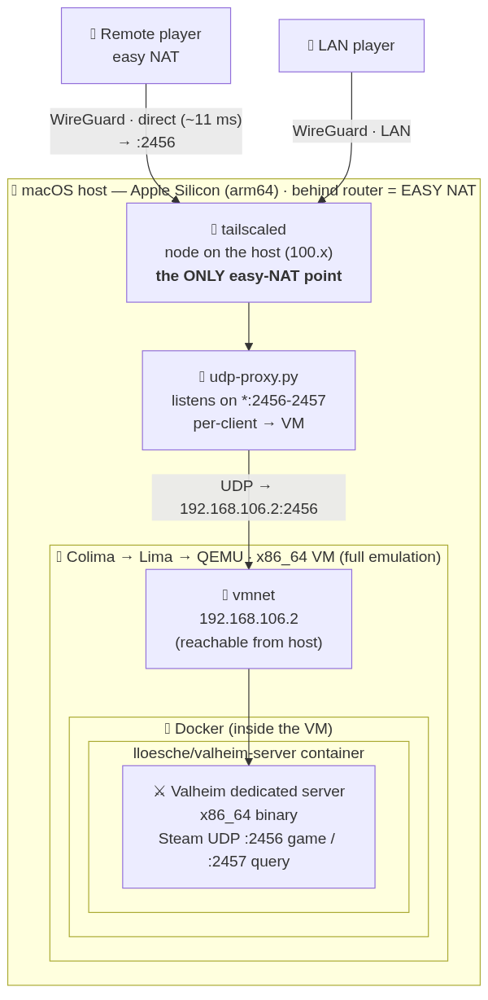

# 🛡️ Valheim on a Mac (Apple Silicon) — private server over Tailscale

> A dedicated **Valheim** server for you and your friends, running on an **Apple-silicon Mac** —
> **for free**, with **no public IP**, **no port-forwarding**, and **remote players on a direct
> P2P link (low ping)**. One command to start, one to stop.


|  | |
|---|---|
| **What** | A fully scripted Valheim server that runs on your Mac and is reachable by your friends **only inside your private Tailscale network**. |
| **Why** | So **anyone can hop in whenever they want** — without hosting anything themselves, without exposing ports to the internet, and without paying for a monthly game host. The world stays up regardless of who is online. |
| **How** | The server (an **x86_64** binary) runs in an emulated VM (**QEMU**) inside **Docker**; **Tailscale on the Mac host** gives friends a secure, **direct** tunnel (direct P2P, not a relay → low ping). |

---

## ✨ What you get

- 💸 **$0** — no hosting bill; runs on hardware you already own.
- 🔒 **Private** — no public IP, no open ports on your router; only your tailnet can reach it.
- 🎮 **Remote players play smoothly** — the Tailscale node lives on the host (easy NAT), so you get **direct P2P** instead of a DERP relay (the usual cause of rubber-banding).
- ⚡ **One command** — `play.sh` brings everything up, `stop.sh` tears it down and lets the Mac sleep.
- 💾 **Hands-off** — automatic server updates and periodic world backups out of the box.
- 🧩 **Bring your own world** — import an existing world (`.db` + `.fwl`) and keep playing.

## 🧱 Stack

| Layer | Technology | Role |
|---|---|---|
| 🖥️ Host | **macOS · Apple Silicon (arm64)** | the machine + the network node (behind the router's **easy NAT**) |
| 🔑 Network | **Tailscale** (WireGuard) | private tunnel, **direct P2P**, zero port-forwarding |
| 🔀 UDP bridge | **udp-proxy.py** | host→VM relay (Lima doesn't forward UDP) |
| 📦 Virtualization | **Colima · Lima · QEMU** | **x86_64** emulation on arm64 |
| 🐳 Container | **Docker · [lloesche/valheim-server](https://github.com/lloesche/valheim-server-docker)** | the server + auto-update + backups |
| ⚔️ Game | **Valheim dedicated** | the actual server |

## 🗺️ How it works (one picture)

A packet's journey from a player to the game engine — the nested layers of abstraction:



> 📐 Full architecture, a sequence diagram, and **why the Tailscale node must live on the host and
> not inside the VM** (the root of the lag problem): **[ARCHITECTURE.md](ARCHITECTURE.md)**.

---

## 🚀 Quick start

```bash
git clone <this-repo> valheim-server && cd valheim-server

./scripts/bootstrap.sh           # 1. installs colima, qemu, lima-additional-guestagents, docker
cp .env.example .env             # 2. (bootstrap does this for you if missing)
$EDITOR .env                     #    fill in: SERVER_NAME, SERVER_PASS (min. 5 chars)
./scripts/doctor.sh              # 3. preflight check
./scripts/setup.sh               # 4. provision (first run ~15+ min: emulates x86 + downloads the server)
```

Direct P2P for remote players requires **Tailscale running on the Mac host** (one-time:
`brew install tailscale && sudo brew services start tailscale && tailscale up`). The `play.sh` /
`stop.sh` scripts handle the rest (vmnet + the UDP bridge). Details and the "simple" variant
(in-VM sidecar): [ARCHITECTURE.md](ARCHITECTURE.md).

Day to day: **`./scripts/play.sh`** when you play, **`./scripts/stop.sh`** when you're done.

## 🧰 Scripts

| Script | Purpose |
|---|---|
| `scripts/bootstrap.sh` | one-time: installs all dependencies (Homebrew) |
| `scripts/doctor.sh` | preflight: checks tools + `.env` (changes nothing) |
| `scripts/setup.sh` | one-time: creates the x86_64 VM (QEMU) and brings up the server |
| `scripts/play.sh` | **start a session** — VM + server + UDP bridge + keep-awake (one command) |
| `scripts/stop.sh` | **end a session** — backup + stop bridge/server/VM (Mac can sleep) |
| `scripts/host-ts-bridge.sh` | the host→VM UDP bridge (start/stop/status); launched by `play.sh` |
| `scripts/status.sh` | what's running + the address to share with friends |
| `scripts/logs.sh` | live server logs |
| `scripts/monitor.sh` | sample CPU/mem + top host processes during a session (lag diagnosis) |
| `scripts/backup.sh` | dump the world to the Mac's disk (optionally to Google Drive) |
| `scripts/update.sh` | update the container image |
| `scripts/import-world.sh` | import an existing world (`.db` + `.fwl`) |

## 🎮 How friends connect

1. They install Tailscale and sign in to **their own** account.
2. **You share the node with them** (do NOT invite them to your network — see "Security"): Tailscale
   admin → **Machines → the server node → ⋯ → Share** → send each person the link. They accept.
3. `./scripts/status.sh` shows the address. In game: **Start Game → Join Game → Join IP** →
   `100.x.y.z:2456` + password.

> The server is private (`SERVER_PUBLIC=false`) — it never shows up in the public list, only via "Join IP".
> All players need **Valheim on Steam** (crossplay is off — see [TROUBLESHOOTING.md](TROUBLESHOOTING.md)).

## 📥 Import a world

Ask for **both** files (same base name): `<World>.db` and `<World>.fwl`
(Windows: `%USERPROFILE%\AppData\LocalLow\IronGate\Valheim\worlds_local\`). Then:
```bash
./scripts/import-world.sh ~/Downloads/World.db ~/Downloads/World.fwl
```
The script copies the world, sets `WORLD_NAME` in `.env` and restarts the server. Importing a ready
world **skips** the slow first map generation.

## 💾 Backups

- The image makes periodic zip backups of the world; `./scripts/backup.sh` pulls them onto the Mac
  into `./backups/` (plus the live world as a spare). `stop.sh` does this automatically.
- Cloud: set `GDRIVE_DIR` in `.env` to a folder inside a synced Google Drive.
- Retention: 12 backups in the container, 30 on the Mac (intentionally different).
- **Auto-backup every 30 min (optional)** — LaunchAgent `~/Library/LaunchAgents/com.valheim.backup.plist`:
  ```xml
  <?xml version="1.0" encoding="UTF-8"?>
  <plist version="1.0"><dict>
    <key>Label</key><string>com.valheim.backup</string>
    <key>ProgramArguments</key>
    <array><string>/bin/zsh</string><string>-c</string>
      <string>cd "$HOME/valheim-server" && ./scripts/backup.sh</string></array>
    <key>StartInterval</key><integer>1800</integer>
    <key>StandardErrorPath</key><string>/tmp/valheim-backup.err</string>
  </dict></plist>
  ```
  Load it: `launchctl load ~/Library/LaunchAgents/com.valheim.backup.plist` (only runs while the server is up).

## 🔄 Updates

- The Valheim server **auto-updates itself** every 15 min while nobody is playing. `./scripts/update.sh`
  updates the container image (rarely needed).
- **Before a session**, agree on "update your clients" — server and players must be on the same
  version, otherwise "Incompatible version".

## 🛰️ Remote management (optional)

To start the server from outside your home: you already run Tailscale on the Mac for direct P2P, so
just enable **System Settings → General → Sharing → Remote Login**, then from any device on the
tailnet: `ssh user@<Mac-tailscale-IP>` → `cd ~/valheim-server && ./scripts/play.sh`.

## 😴 The Mac must not sleep while playing

`play.sh` runs `caffeinate -ims` — it keeps the **system** awake but lets the **display** sleep
(a headless server doesn't need the screen on; saves a few watts).

**Lid closed is fine — as long as you stay on power.** The `-s` flag holds a `PreventSystemSleep`
assertion that keeps the Mac running in clamshell mode while on AC, so you can shut the lid mid-session
and the server keeps serving (verified: 24h+ continuous uptime with the lid closed). Check it with
`pmset -g assertions` — you'll see `caffeinate ... PreventSystemSleep`. If you unplug, lid-closed will
sleep; as a fallback you can force-disable sleep with `sudo pmset -c disablesleep 1` (`...0` to undo).

The server only runs while the Mac is **logged in** (Colima/docker live in the user session).

## 📊 What to expect (performance)

- It's **emulation** — the first world generation under QEMU is slow (~20+ min, **one-time**;
  importing a ready world skips it). Actual gameplay is much lighter.
- An idle server uses ~1 Mac core (a Valheim trait + QEMU overhead) — drops to 0 after `stop.sh`.
- For ~3 casual players there's plenty of headroom. This is **not** a 24/7 server — the Mac must be
  awake and logged in.

**If everyone lags at the same moment**, the server tick is stalling — usually because a background
host process (Spotlight reindex, Time Machine, cloud sync) stole CPU from the x86 emulator. Since the
server is authoritative, a host hiccup freezes all players at once (a single player lagging is *their*
network instead). `play.sh` can `renice` QEMU to `-10` so it wins that contention. This is **optional**
and `play.sh` works fine without it — by default it tries silently and skips (with a hint) if it can't,
so a fresh clone never gets surprised by a password prompt. Controlled by `VALHEIM_RENICE`:

| `VALHEIM_RENICE` | Behaviour |
|---|---|
| `auto` *(default)* | apply the boost **only if** the NOPASSWD rule below is installed; otherwise skip silently |
| `ask` | prompt for your sudo password each session (no rule needed) — `VALHEIM_RENICE=ask ./scripts/play.sh` |
| `off` | never touch priority |

For unattended, prompt-free boosting, add a narrow NOPASSWD rule once (only `renice`, only your user):

```bash
echo "$(whoami) ALL=(root) NOPASSWD: /usr/bin/renice" | sudo tee /etc/sudoers.d/valheim-renice >/dev/null
sudo chmod 0440 /etc/sudoers.d/valheim-renice && sudo visudo -cf /etc/sudoers.d/valheim-renice
```

To catch the culprit live next time, run `./scripts/monitor.sh [minutes]` during a session — it logs
container/host CPU and the **top host processes** each tick to `/tmp/valheim-usage.log`.

## 🔐 Security

- **Secrets never go to the repo:** `.env` (password) is in `.gitignore`. Commit only `.env.example`.
- **Share the node, don't invite a user:** inviting someone to your tailnet gives them access to your
  WHOLE network (e.g. Home Assistant); Share grants access to the server node only.

## 🆘 Trouble?

**[TROUBLESHOOTING.md](TROUBLESHOOTING.md)** — real-world pitfalls (missing x86_64 guest agent, SteamCMD
timeouts, "failed to connect" during generation, slow restarts, idle CPU, Tailscale share vs invite,
direct vs relay).

## 🙏 Credits

[lloesche/valheim-server-docker](https://github.com/lloesche/valheim-server-docker) ·
[Colima](https://github.com/abiosoft/colima) · [Lima](https://github.com/lima-vm/lima) ·
[Tailscale](https://tailscale.com) · Iron Gate (Valheim).

## 📄 License

MIT — see [LICENSE](LICENSE).
